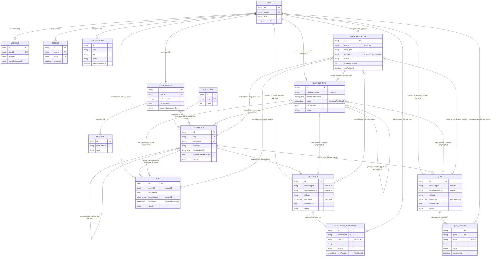

# Database Schema Plan — Skill Track AI

Status: **planning document** (design proposal). Nothing here has been applied to the live
`prisma/**/*.schema.prisma` files. It extends the verified current state:

- `prisma/users/users.schema.prisma` — `User`, `Account`, `Session`, `UserProfile`, `Address`.
- `prisma/technologies/technologies.schema.prisma` — a single thin `Technologies` model
  (`name`, `description`, `icon`, `quiz: String[]`, `mcqQuestion: Int`, `codingQuestion: Int`).
- `prisma/notes/notes.schema.prisma` — `Note` with embedded `QuestionAnswer[]` (Quill Delta JSON),
  `authorRole`, `visibility`, cross-DB `authorId`/`technologies` as plain strings.
- `SPEC.md` + `docs/roadmap/01-05` — Phase 1 (auth, technologies, notes, quizzes) is in progress;
  Phase 2 adds coding challenges; Phase 4 adds learning paths / adaptive learning; Phase 5 adds
  subscription/organization concerns. `docs/database-design.md` and
  `docs/entity-relation-diagram.md` are earlier planning artifacts and are treated here as
  directional intent only, not ground truth (e.g. they describe `sessions`/`verificationTokens`
  as standalone collections; the real schema inlines these fields on `User`/`Session`).

---

## 1. Design principles for portability (Mongo now, Postgres/DynamoDB-movable later)

Skill Track AI runs on MongoDB via Prisma today but SPEC.md's objective #3 is "scale to millions
of users without architectural changes." That constrains _how_ we use MongoDB, not just what
collections exist. Rules below apply to every model in this plan and to the existing three
domains:

1. **IDs are opaque strings everywhere above the Prisma schema layer.** `src/types/*` and service
   signatures must type ids as `string`, never a Mongo-specific `ObjectId` type. This is already
   the pattern (`Note.authorId: string`) — keep it universal so a future swap to Postgres UUIDs or
   DynamoDB composite keys touches only the Prisma layer, not `src/services/*` or `src/types/*`.

2. **Every embed-vs-reference decision is documented in the schema as a comment, with the
   reasoning, not just the shape.** MongoDB embedding is a query-shape optimization; when it's
   undone in Postgres it becomes a join table, and in DynamoDB it becomes an item-collection
   (same partition key, different sort key prefix). Reviewers need to be able to "replay" the
   decision later. Rule applied throughout this doc: embed only when the child data is (a)
   bounded in count, (b) always read together with the parent, and (c) not queried/aggregated
   independently. Otherwise reference by id string.

3. **No unbounded embedded arrays.** `QuizQuestion[]` on `Quiz` and `TestCase[]` on `Challenge`
   are bounded by authoring effort (tens, not thousands) — fine to embed. `QuizAttempt` (grows
   forever, one per user per attempt) and `ChallengeSubmission` (same) are **never** embedded in
   their parent — they are top-level collections referencing the parent by id. This mirrors the
   existing precedent: `Note.questions` is embedded (bounded, authored once) while attempts/
   submissions are not modeled that way anywhere in this plan.

4. **Avoid `$lookup`-only query patterns.** Prisma on Mongo can technically `include` within a
   single domain database (e.g. `Quiz` ← `QuizQuestion` if it were a separate collection, or
   `UserProfile` ← `Address`), which compiles to `$lookup`. Prefer embedding for 1:few
   parent-child data (rule 3) so reads are single-document `findUnique` calls with `select` on
   subfields — this is both the Mongo-idiomatic and the Postgres/DynamoDB-portable shape (a
   single-document read maps directly to a single-item read in DynamoDB, no join required). Where
   a same-domain relation genuinely needs independent querying (e.g. `QuizAttempt` needs to be
   queried by `userId` across all quizzes, so it cannot be embedded in `Quiz`), keep it a real
   Prisma relation but always query it directly (`quizAttempt.findMany({ where: { userId }})`),
   never via a `$lookup` traversal from the parent.

5. **Cross-domain references are always app-layer, always plain `@db.ObjectId` strings, and are
   documented with a comment naming the owning domain + collection** (already the house style —
   `Note.authorId` comments its target). This is non-negotiable per `CLAUDE.md` and happens to
   also be the most portable shape: a cross-domain reference in Mongo is _already_ structurally
   identical to a cross-service reference in a microservice/DynamoDB-per-domain architecture, so
   there is zero rework needed when domains move to independent databases or engines at different
   times.

6. **Access patterns are enumerated before modeling, not discovered after.** DynamoDB requires
   this by construction (single-table design needs every access pattern up front); doing it now
   for Mongo means the indexing strategy (§5) is derived from real query patterns, and doubles as
   the DynamoDB PK/SK design if that migration ever happens (§6 has the mapping). Each new model
   below is preceded by its access patterns in the indexing section.

7. **Denormalized/cached fields are named `cachedX` or grouped under a `*Stats` embedded type,
   updated asynchronously, and never treated as source of truth.** This matches
   `docs/database-design.md`'s existing "Denormalization Strategy" note (`UserProfile` caches quiz
   stats). Keeping cached fields structurally separate from authoritative fields means a Postgres
   migration can drop them into a materialized view and a DynamoDB migration can drop them into a
   GSI projection, without renaming application-facing fields.

8. **No cross-domain `onDelete: Cascade`.** Cascade only works within one Prisma schema/database.
   Cross-domain cleanup (e.g. deleting a `User` should eventually clean up their `Note`s,
   `QuizAttempt`s, `UserProgress`) must be an explicit application-layer job (event/outbox or
   scheduled sweep), not a Prisma feature. Document this per cross-domain reference below.

---

## 2. Enterprise-scale entity model

Keeping the **one-Mongo-database-per-domain, no-cross-domain-Prisma-relations** architecture
(hard constraint from `CLAUDE.md`), the domain map grows from 3 to 6:

| Domain          | Schema file                                        | Status              | Models                                                                               |
| --------------- | -------------------------------------------------- | ------------------- | ------------------------------------------------------------------------------------ |
| `users`         | `prisma/users/users.schema.prisma`                 | existing, extended  | `User`, `Account`, `Session`, `UserProfile`, `Address`, **`Subscription`** (new)     |
| `technologies`  | `prisma/technologies/technologies.schema.prisma`   | existing, rebuilt   | **`Category`** (new), `Technology` (rebuilt from `Technologies`)                     |
| `notes`         | `prisma/notes/notes.schema.prisma`                 | existing, unchanged | `Note` (embedded `QuestionAnswer[]`)                                                 |
| `quizzes`       | `prisma/quizzes/quizzes.schema.prisma`             | **new**             | `Quiz` (embedded `QuizQuestion[]`/`QuestionOption[]`), `QuizAttempt`                 |
| `challenges`    | `prisma/challenges/challenges.schema.prisma`       | **new** (Phase 2)   | `Challenge` (embedded `TestCase[]`), `ChallengeSubmission` (embedded `TestResult[]`) |
| `learningPaths` | `prisma/learningPaths/learningPaths.schema.prisma` | **new** (Phase 4)   | `LearningPath` (embedded `LearningPathStep[]`)                                       |
| `progress`      | `prisma/progress/progress.schema.prisma`           | **new**             | `UserProgress` (polymorphic, generic)                                                |

Why `quizzes`, `challenges`, `learningPaths`, and `progress` are each their own database rather
than folded into `technologies` or `users`:

- **`quizzes`** and **`challenges`** are write-heavy (every attempt/submission is a write) and
  scale independently of the read-heavy `technologies` catalog. Splitting them lets each be
  sharded/scaled on its own schedule (see §6).
- **`progress`** is the highest-write-volume, highest-growth collection in the whole system (one
  row per user per content item, updated on every interaction) and is polymorphic across every
  other domain. Isolating it means its shard key and write throughput provisioning never compete
  with `users` auth traffic, and it can be moved to a purpose-built store (e.g. DynamoDB) first if
  a single domain ever needs to migrate off Mongo before the others.
- **`learningPaths`** is curation/content data (admin-authored, low write volume, read-heavy) —
  architecturally closer to `technologies` than to `progress`, but kept separate because its
  content model (ordered polymorphic steps referencing three other domains) is its own bounded
  context and its own team/ownership surface as the roadmap's Phase 4 "curriculum builder" lands.
- **`Subscription`** stays inside `users` (not a new domain) because it is 1:1-ish with `User`,
  low volume, and every read of it happens alongside a user/session read (JWT-time entitlement
  checks) — splitting it would force a cross-domain join on the hottest auth path for no benefit.
- **`Category`** stays inside `technologies` (not a new domain) because it's a small, low-write,
  tightly-coupled taxonomy of `Technology` and benefits from being a real same-DB Prisma relation.

Cross-domain references introduced by this plan (all plain `@db.ObjectId` strings, app-layer
enforced, no cascade):

| Field                             | Domain it lives in       | References                                                                                    | Owning domain                                               |
| --------------------------------- | ------------------------ | --------------------------------------------------------------------------------------------- | ----------------------------------------------------------- |
| `Subscription.userId`             | users                    | `User.id`                                                                                     | users (same DB — real relation)                             |
| `Technology.categoryId`           | technologies             | `Category.id`                                                                                 | technologies (same DB — real relation)                      |
| `Quiz.technologyId`               | quizzes                  | `Technology.id`                                                                               | technologies                                                |
| `Quiz.createdByUserId`            | quizzes                  | `User.id`                                                                                     | users                                                       |
| `QuizAttempt.userId`              | quizzes                  | `User.id`                                                                                     | users                                                       |
| `QuizAttempt.quizId`              | quizzes                  | `Quiz.id`                                                                                     | quizzes (same DB — real relation)                           |
| `Challenge.technologyId`          | challenges               | `Technology.id`                                                                               | technologies                                                |
| `Challenge.createdByUserId`       | challenges               | `User.id`                                                                                     | users                                                       |
| `ChallengeSubmission.userId`      | challenges               | `User.id`                                                                                     | users                                                       |
| `ChallengeSubmission.challengeId` | challenges               | `Challenge.id`                                                                                | challenges (same DB — real relation)                        |
| `LearningPath.createdByUserId`    | learningPaths            | `User.id`                                                                                     | users                                                       |
| `LearningPathStep.contentId`      | learningPaths (embedded) | polymorphic: `Technology.id` \| `Quiz.id` \| `Challenge.id` \| `Note.id`                      | technologies / quizzes / challenges / notes                 |
| `UserProgress.userId`             | progress                 | `User.id`                                                                                     | users                                                       |
| `UserProgress.entityId`           | progress                 | polymorphic: `Technology.id` \| `Quiz.id` \| `Challenge.id` \| `LearningPath.id` \| `Note.id` | technologies / quizzes / challenges / learningPaths / notes |

---

## 3. Complete ERD



---

## 4. Full Prisma schema code (proposed)

### 4.1 `prisma/users/users.schema.prisma` — additions

`User`, `Account`, `Session`, `UserProfile`, `Address` are unchanged. Add:

```prisma
/// Subscription tier catalog. Feature gating per tier lives in app config
/// (src/config), not the DB — this model only tracks *entitlement state* for
/// a user, not plan definitions, so adding/renaming plan features never
/// requires a migration.
enum SubscriptionTier {
  FREE
  S1
  S2
  S3
}

enum SubscriptionStatus {
  ACTIVE
  PAST_DUE
  CANCELED
  EXPIRED
  TRIALING
}

model Subscription {
  id     String @id @default(auto()) @map("_id") @usersDb.ObjectId
  userId String @usersDb.ObjectId
  user   User   @relation(fields: [userId], references: [id], onDelete: Cascade)

  tier   SubscriptionTier   @default(FREE)
  status SubscriptionStatus @default(ACTIVE)

  /// External billing provider reference (Stripe subscription id, etc.) —
  /// opaque string so swapping billing providers never touches the schema.
  providerSubscriptionId String?
  provider               String? // "stripe", "paddle", etc.

  currentPeriodStart DateTime?
  currentPeriodEnd   DateTime?
  cancelAtPeriodEnd  Boolean   @default(false)

  createdAt DateTime @default(now())
  updatedAt DateTime @updatedAt

  // One user can have historical subscriptions (upgrades/downgrades/renewals);
  // "current" tier is resolved as the most recent ACTIVE/TRIALING row by app
  // logic and cached onto UserProfile.cachedSubscriptionTier for hot-path reads.
  @@index([userId, status])
  @@index([userId, createdAt])
  @@map("user-subscription")
}
```

Add relation field + cached fields to existing models (additive, non-breaking):

```prisma
model User {
  // ...existing fields unchanged...
  subscriptions Subscription[]
}

model UserProfile {
  // ...existing fields unchanged...

  /// Cached, denormalized, async-updated. Never authoritative — Subscription
  /// rows are the source of truth. Avoids a cross-collection read on every
  /// profile fetch.
  cachedSubscriptionTier SubscriptionTier @default(FREE)

  /// Cached learning stats, replaces ad-hoc aggregation on dashboard load.
  /// Updated by the progress domain's write path (best-effort async job),
  /// same pattern as docs/database-design.md's existing denormalization note.
  cachedStats UserCachedStats?
}

/// Embedded — always read as part of the profile, never queried standalone.
type UserCachedStats {
  quizzesTaken     Int      @default(0)
  quizzesPassed    Int      @default(0)
  avgQuizScore     Float    @default(0)
  notesCreated     Int      @default(0)
  challengesSolved Int      @default(0)
  currentStreak    Int      @default(0)
  longestStreak    Int      @default(0)
  lastActivityAt   DateTime?
}
```

### 4.2 `prisma/technologies/technologies.schema.prisma` — rebuilt

```prisma
generator techClient {
    provider = "prisma-client-js"
    output   = "../../node_modules/@prisma-custom/technologies"
}

datasource techDb {
    provider = "mongodb"
    url      = env("TECHNOLOGIES_DB_URI")
}

enum DifficultyLevel {
  BEGINNER
  INTERMEDIATE
  ADVANCED
  EXPERT
}

enum ContentStatus {
  DRAFT
  PUBLISHED
  ARCHIVED
}

model Category {
  id          String  @id @default(auto()) @map("_id") @techDb.ObjectId
  name        String  @unique
  slug        String  @unique
  description String?
  icon        String?
  order       Int     @default(0)

  technologies Technology[]

  createdAt DateTime @default(now())
  updatedAt DateTime @updatedAt

  @@index([order])
  @@map("categories")
}

/// Cached content counts, updated async whenever a Quiz/Note/Challenge in
/// another domain is created/published against this technology. Avoids a
/// cross-domain fan-out count query on every technology list/detail render
/// (SPEC.md "Cache technology list: 1 hour" caching strategy relies on this
/// being cheap to read).
type TechnologyContentCounts {
  quizCount      Int @default(0)
  noteCount      Int @default(0)
  challengeCount Int @default(0)
}

model Technology {
  id          String  @id @default(auto()) @map("_id") @techDb.ObjectId
  name        String  @unique
  slug        String  @unique
  description String?
  icon        String?

  categoryId String   @techDb.ObjectId
  category   Category @relation(fields: [categoryId], references: [id])

  difficulty DifficultyLevel @default(BEGINNER)

  /// Self-referential prerequisite graph. NOT a Prisma relation — Mongo has
  /// no native many-to-many join table, and a self-relation here would
  /// require an intermediate collection for no real benefit at this scale.
  /// Resolved by the service layer (fetch by ids, batch). Document this
  /// explicitly: if this ever moves to Postgres, this becomes a
  /// `technology_prerequisites (technology_id, prerequisite_id)` join table.
  prerequisiteIds String[] @techDb.ObjectId

  tags       String[]
  isFeatured Boolean @default(false)
  isPremium  Boolean @default(false)
  status     ContentStatus @default(DRAFT)

  cachedContentCounts TechnologyContentCounts?

  createdAt DateTime @default(now())
  updatedAt DateTime @updatedAt

  @@index([categoryId, difficulty])
  @@index([status, isFeatured])
  @@index([tags])
  @@map("technologies")
}
```

Migration/breaking-change note: this **replaces** the current `Technologies` model (`quiz:
String[]`, `mcqQuestion: Int`, `codingQuestion: Int` are dropped in favor of
`cachedContentCounts`, and the collection/model name changes from `Technologies`/`technologies`
to `Technology`/`technologies`). Existing documents need a backfill script: derive
`cachedContentCounts` from the new `quizzes`/`notes`/`challenges` collections once they exist, and
set `categoryId` by creating a default `Category` and pointing all pre-existing rows at it
(categories didn't exist before). Coordinate with whoever owns `src/services/technologiesService.ts`
before applying, since `mcqQuestion`/`codingQuestion`/`quiz` field removal is a breaking API
contract change.

### 4.3 `prisma/quizzes/quizzes.schema.prisma` (new)

```prisma
generator quizzesClient {
    provider = "prisma-client-js"
    output   = "../../node_modules/@prisma-custom/quizzes"
}

datasource quizzesDb {
    provider = "mongodb"
    url      = env("QUIZZES_DB_URI")
}

enum QuizQuestionType {
  SINGLE_CHOICE
  MULTI_CHOICE
  TRUE_FALSE
}

enum ContentStatus {
  DRAFT
  PUBLISHED
  ARCHIVED
}

enum DifficultyLevel {
  BEGINNER
  INTERMEDIATE
  ADVANCED
  EXPERT
}

enum AttemptStatus {
  IN_PROGRESS
  SUBMITTED
  ABANDONED
}

/// Embedded — options only ever read/written as part of their parent
/// question, never queried independently. Bounded (a handful per question).
type QuestionOption {
  id   String
  text String
  /// isCorrect is stripped by the service layer before sending question
  /// payloads to unauthenticated/preview clients (SPEC.md: guests can
  /// preview but not see correct answers). Never trust the client to omit it.
  isCorrect Boolean @default(false)
}

/// Embedded in Quiz — same reasoning as Note.questions: bounded count
/// (tens of questions per quiz, authored once), always read together with
/// the quiz, never queried/filtered independently of its parent quiz.
/// If this domain ever moves to Postgres: Quiz -> quiz_questions -> options
/// becomes two join tables. If it moves to DynamoDB: Quiz and its questions
/// become one item (questions as a Map/List attribute), consistent with how
/// it's already modeled here.
type QuizQuestion {
  id          String
  text        String
  type        QuizQuestionType @default(SINGLE_CHOICE)
  options     QuestionOption[]
  explanation String?
  points      Int              @default(1)
  order       Int              @default(0)
}

/// Cached, async-updated aggregate stats — never authoritative (derived from
/// QuizAttempt). Avoids a COUNT/AVG aggregation on every quiz list/detail read.
type QuizStats {
  attemptCount     Int   @default(0)
  avgScorePercent  Float @default(0)
  completionRate   Float @default(0)
}

model Quiz {
  id String @id @default(auto()) @map("_id") @quizzesDb.ObjectId

  /// Maps to Technology.id (@prisma-custom/technologies). Cross-DB reference,
  /// app-layer enforced — same pattern as Note.technologies.
  technologyId String @quizzesDb.ObjectId

  /// Maps to User.id (@prisma-custom/users), the admin who authored this quiz.
  createdByUserId String @quizzesDb.ObjectId

  title       String
  slug        String  @unique
  description String?
  difficulty  DifficultyLevel @default(BEGINNER)

  questions QuizQuestion[]

  timeLimitSeconds     Int?
  passingScorePercent  Int  @default(70)
  maxAttempts          Int? // null = unlimited
  isPremium            Boolean @default(false)
  status               ContentStatus @default(DRAFT)

  cachedStats QuizStats?

  createdAt DateTime @default(now())
  updatedAt DateTime @updatedAt

  attempts QuizAttempt[]

  @@index([technologyId, status])
  @@index([status, isPremium, difficulty])
  @@map("quizzes")
}

/// Embedded in QuizAttempt — bounded by the parent quiz's question count,
/// always written/read atomically with the attempt (one submit = one write).
type AttemptAnswer {
  questionId       String
  selectedOptionIds String[]
  isCorrect        Boolean @default(false)
  pointsAwarded    Float   @default(0)
}

model QuizAttempt {
  id String @id @default(auto()) @map("_id") @quizzesDb.ObjectId

  quizId String @quizzesDb.ObjectId
  quiz   Quiz   @relation(fields: [quizId], references: [id], onDelete: Cascade)

  /// Maps to User.id (@prisma-custom/users). Cross-DB reference, app-layer
  /// enforced — extracted from JWT, never trusted from the request body.
  userId String @quizzesDb.ObjectId

  answers        AttemptAnswer[]
  scorePercent   Float   @default(0)
  maxScore       Int     @default(0)
  passed         Boolean @default(false)
  status         AttemptStatus @default(IN_PROGRESS)

  startedAt        DateTime  @default(now())
  submittedAt      DateTime?
  timeSpentSeconds Int?

  createdAt DateTime @default(now())
  updatedAt DateTime @updatedAt

  @@index([userId, quizId, createdAt])
  @@index([quizId, createdAt])
  @@index([userId, status])
  @@map("quiz-attempts")
}
```

### 4.4 `prisma/challenges/challenges.schema.prisma` (new, Phase 2)

```prisma
generator challengesClient {
    provider = "prisma-client-js"
    output   = "../../node_modules/@prisma-custom/challenges"
}

datasource challengesDb {
    provider = "mongodb"
    url      = env("CHALLENGES_DB_URI")
}

enum DifficultyLevel {
  BEGINNER
  INTERMEDIATE
  ADVANCED
  EXPERT
}

enum ContentStatus {
  DRAFT
  PUBLISHED
  ARCHIVED
}

enum SubmissionStatus {
  PENDING
  RUNNING
  PASSED
  FAILED
  RUNTIME_ERROR
  TIMEOUT
}

/// Embedded in Challenge — bounded (a handful to a few dozen test cases per
/// challenge), authored once by an admin, always read together with the
/// challenge (the sandboxed runner needs the full set in one fetch).
type TestCase {
  id               String
  input            Json
  expectedOutput   Json
  isHidden         Boolean @default(false) // hidden cases withheld from the learner, shown only in results
  points           Int     @default(1)
  timeLimitMs      Int     @default(2000)
  memoryLimitMb    Int     @default(128)
  order            Int     @default(0)
}

type ChallengeStats {
  submissionCount Int   @default(0)
  passRate        Float @default(0)
}

model Challenge {
  id String @id @default(auto()) @map("_id") @challengesDb.ObjectId

  /// Maps to Technology.id (@prisma-custom/technologies). Cross-DB, app-layer.
  technologyId String @challengesDb.ObjectId
  /// Maps to User.id (@prisma-custom/users), authoring admin.
  createdByUserId String @challengesDb.ObjectId

  title       String
  slug        String @unique
  description String // markdown problem statement
  difficulty  DifficultyLevel @default(BEGINNER)

  /// Supported languages + per-language starter code. Embedded: small,
  /// bounded (one entry per supported language), always read with the
  /// challenge.
  starterCode Json // { "python": "...", "javascript": "...", ... }
  languages   String[]

  testCases TestCase[]

  isPremium Boolean       @default(false)
  status    ContentStatus @default(DRAFT)

  cachedStats ChallengeStats?

  createdAt DateTime @default(now())
  updatedAt DateTime @updatedAt

  submissions ChallengeSubmission[]

  @@index([technologyId, status])
  @@index([status, isPremium, difficulty])
  @@map("challenges")
}

/// Embedded in ChallengeSubmission — bounded by the parent challenge's
/// test-case count, written once per submission by the sandboxed runner.
type TestResult {
  testCaseId       String
  passed           Boolean
  actualOutput     Json?
  errorMessage     String?
  executionTimeMs  Int?
  memoryUsedMb     Int?
}

model ChallengeSubmission {
  id String @id @default(auto()) @map("_id") @challengesDb.ObjectId

  challengeId String    @challengesDb.ObjectId
  challenge   Challenge @relation(fields: [challengeId], references: [id], onDelete: Cascade)

  /// Maps to User.id (@prisma-custom/users). Cross-DB, app-layer, from JWT.
  userId String @challengesDb.ObjectId

  language String
  code     String // submitted source, size-guarded at the API layer

  status       SubmissionStatus @default(PENDING)
  testResults  TestResult[]
  scorePercent Float @default(0)

  executionTimeMs Int?
  memoryUsedMb    Int?

  submittedAt DateTime @default(now())
  createdAt   DateTime @default(now())
  updatedAt   DateTime @updatedAt

  @@index([userId, challengeId, submittedAt])
  @@index([challengeId, status])
  @@index([userId, submittedAt])
  @@map("challenge-submissions")
}
```

### 4.5 `prisma/learningPaths/learningPaths.schema.prisma` (new, Phase 4)

```prisma
generator learningPathsClient {
    provider = "prisma-client-js"
    output   = "../../node_modules/@prisma-custom/learning-paths"
}

datasource learningPathsDb {
    provider = "mongodb"
    url      = env("LEARNING_PATHS_DB_URI")
}

enum DifficultyLevel {
  BEGINNER
  INTERMEDIATE
  ADVANCED
  EXPERT
}

enum ContentStatus {
  DRAFT
  PUBLISHED
  ARCHIVED
}

enum LearningPathContentType {
  TECHNOLOGY
  QUIZ
  CHALLENGE
  NOTE
}

/// Embedded in LearningPath — ordered curriculum steps are bounded (tens per
/// path), authored as a unit by an admin/curriculum builder, and always read
/// together with the path (a learner fetches the whole path to render it).
/// contentId is a polymorphic cross-domain reference — resolved by the
/// service layer per contentType (fan-out fetch to technologies/quizzes/
/// challenges/notes). Never queried independently of its parent path.
type LearningPathStep {
  id             String
  order          Int
  contentType    LearningPathContentType
  contentId      String // cross-DB, polymorphic — see contentType
  title          String
  isOptional     Boolean @default(false)
  estimatedMinutes Int   @default(0)
}

type LearningPathStats {
  enrollmentCount        Int   @default(0)
  completionCount        Int   @default(0)
  avgCompletionDays      Float @default(0)
}

model LearningPath {
  id String @id @default(auto()) @map("_id") @learningPathsDb.ObjectId

  title       String
  slug        String  @unique
  description String?
  difficulty  DifficultyLevel @default(BEGINNER)

  /// Maps to User.id (@prisma-custom/users), authoring admin.
  createdByUserId String @learningPathsDb.ObjectId

  /// Self-referential, same reasoning as Technology.prerequisiteIds — not a
  /// Prisma relation, app-resolved.
  prerequisitePathIds String[] @learningPathsDb.ObjectId

  steps LearningPathStep[]

  isPremium Boolean       @default(false)
  status    ContentStatus @default(DRAFT)

  cachedStats LearningPathStats?

  createdAt DateTime @default(now())
  updatedAt DateTime @updatedAt

  @@index([status, isPremium, difficulty])
  @@map("learning-paths")
}
```

### 4.6 `prisma/progress/progress.schema.prisma` (new)

```prisma
generator progressClient {
    provider = "prisma-client-js"
    output   = "../../node_modules/@prisma-custom/progress"
}

datasource progressDb {
    provider = "mongodb"
    url      = env("PROGRESS_DB_URI")
}

enum ProgressEntityType {
  TECHNOLOGY
  QUIZ
  CHALLENGE
  LEARNING_PATH
  NOTE
}

enum ProgressStatus {
  NOT_STARTED
  IN_PROGRESS
  COMPLETED
  ABANDONED
}

model UserProgress {
  id String @id @default(auto()) @map("_id") @progressDb.ObjectId

  /// Maps to User.id (@prisma-custom/users). Cross-DB, app-layer, from JWT.
  userId String @progressDb.ObjectId

  /// Polymorphic cross-domain reference — entityType picks which domain
  /// entityId points into (see docs/roadmap/04-personalization.md and
  /// SPEC.md's UserProgress description). Kept generic on purpose so new
  /// content types never require a schema change here.
  entityType ProgressEntityType
  entityId   String @progressDb.ObjectId

  status          ProgressStatus @default(NOT_STARTED)
  progressPercent Int            @default(0)

  /// Free-form extra state per entityType (e.g. { lastQuestionIndex } for a
  /// quiz-in-progress, { currentStepId } for a learning path). Deliberately
  /// untyped Json — this is the "escape hatch" field the polymorphic model
  /// exists for; do not promote ad-hoc keys here into top-level columns
  /// unless they're needed across all entityTypes.
  metadata Json?

  startedAt      DateTime?
  completedAt    DateTime?
  lastActivityAt DateTime  @default(now())

  createdAt DateTime @default(now())
  updatedAt DateTime @updatedAt

  /// One progress row per (user, entity) — writes are upserts keyed on this.
  @@unique([userId, entityType, entityId])
  @@index([userId, entityType, status])
  @@index([userId, lastActivityAt])
  @@index([entityType, entityId])
  @@map("user-progress")
}
```

Add matching entries to `package.json` scripts and run:

```bash
npm run prisma:generate:all
# or individually while iterating:
npx prisma generate --schema=./prisma/quizzes/quizzes.schema.prisma
npx prisma generate --schema=./prisma/challenges/challenges.schema.prisma
npx prisma generate --schema=./prisma/learningPaths/learningPaths.schema.prisma
npx prisma generate --schema=./prisma/progress/progress.schema.prisma
npx prisma generate --schema=./prisma/technologies/technologies.schema.prisma
npx prisma generate --schema=./prisma/users/users.schema.prisma
```

(and register each new schema in `prisma:generate:all` / add a
`src/lib/prisma<Domain>.ts` singleton per `CLAUDE.md`'s existing pattern before any service code
imports the generated client.)

---

## 5. Indexing strategy

Format: model — access pattern it serves — index — justification.

**users domain**

- `Subscription` — "does this user have an active paid tier" (checked on protected/premium
  routes) → `@@index([userId, status])`. Equality on both fields, no sort needed; this is the hot
  path so it must be a covering-ish index, not a collection scan.
- `Subscription` — "billing history for a user" (account settings page) →
  `@@index([userId, createdAt])`. Equality (`userId`) then sort (`createdAt desc`) — standard
  equality→sort compound ordering.

**technologies domain**

- `Category` — "ordered category list for nav/filters" → `@@index([order])`.
- `Technology` — SPEC.md's `GET /api/technologies/search?category=...&difficulty=...` →
  `@@index([categoryId, difficulty])`. Equality (`categoryId`) then equality (`difficulty`) — both
  filter fields, most-selective-first isn't knowable statically but category is the primary drill
  path per the roadmap's browse-by-category journey.
- `Technology` — "published + featured technologies" (homepage/discovery) →
  `@@index([status, isFeatured])`.
- `Technology` — free-text-ish tag filtering (`GET /api/technologies/search?q=...`) →
  `@@index([tags])` (multikey index over the array).
- `name`/`slug` already `@unique`, which creates the required unique index for direct lookups and
  natural-key enforcement.

**quizzes domain**

- `Quiz` — "quizzes for a technology, published only" (SPEC.md
  `GET /api/quizzes?technology=...&difficulty=...&isPremium=false`) →
  `@@index([technologyId, status])` primary, `@@index([status, isPremium, difficulty])` for the
  cross-technology browse/filter view. Two indexes because the two query shapes have different
  leading equality fields (technology-scoped vs. global catalog browse).
- `QuizAttempt` — SPEC.md explicitly calls out "(userId, quizId, createdAt) for fast retrieval"
  (a user's attempt history for one quiz, most recent first) →
  `@@index([userId, quizId, createdAt])` — equality, equality, sort.
- `QuizAttempt` — "quiz-level stats/leaderboard aggregation" (feeds `Quiz.cachedStats` async job)
  → `@@index([quizId, createdAt])`.
- `QuizAttempt` — "does this user have an in-progress attempt" (resume flow) →
  `@@index([userId, status])`.

**challenges domain**

- `Challenge` — same shape as `Quiz`: `@@index([technologyId, status])` and
  `@@index([status, isPremium, difficulty])`.
- `ChallengeSubmission` — "a user's submission history for a challenge, most recent first" (mirror
  of `QuizAttempt`) → `@@index([userId, challengeId, submittedAt])`.
- `ChallengeSubmission` — "submissions currently queued/running" (sandboxed runner worker poll) →
  `@@index([challengeId, status])`.
- `ChallengeSubmission` — "a user's global submission feed" (profile activity) →
  `@@index([userId, submittedAt])`.

**learningPaths domain**

- `LearningPath` — catalog browse, same shape as `Technology`/`Quiz`/`Challenge` →
  `@@index([status, isPremium, difficulty])`.

**progress domain**

- `UserProgress` — the model is defined by its access patterns since it's polymorphic:
  - "is there already a progress row for (user, entity)" (every write is an upsert) →
    `@@unique([userId, entityType, entityId])`. This is both the correctness constraint (no
    duplicate progress rows) and the index that makes the upsert's `where` clause fast.
  - "a user's progress list filtered by content type + status" (dashboard "in progress" /
    "completed" tabs, SPEC.md's `entityType`/`status` fields) →
    `@@index([userId, entityType, status])`.
  - "a user's recently-active items" ("continue learning" widget) →
    `@@index([userId, lastActivityAt])` (equality then sort).
  - "aggregate stats for one piece of content across all users" (feeds `cachedStats` on
    `Quiz`/`Challenge`/`LearningPath`/`Technology`) → `@@index([entityType, entityId])`.

**notes domain** (existing, unchanged) already has the right shape — `[authorId]`,
`[authorId, isArchived]`, `[authorRole, visibility]`, `[authorId, authorRole, isArchived]` — no
changes proposed.

---

## 6. Scale/sharding notes

### Shard key candidates per domain

| Domain        | Collection              | Candidate shard key         | Reasoning                                                                                                                                                                                          |
| ------------- | ----------------------- | --------------------------- | -------------------------------------------------------------------------------------------------------------------------------------------------------------------------------------------------- |
| users         | `user-auth`             | `_id` (hashed)              | Lookups are always by id (from JWT) or unique `email`; no natural range-scan pattern, so hashed `_id` gives the most even write distribution.                                                      |
| users         | `user-subscription`     | `userId` (hashed)           | Always accessed by `userId`; co-locating a user's subscription writes avoids cross-shard chatter on entitlement checks.                                                                            |
| technologies  | `technologies`          | `_id` (hashed) or unsharded | Read-heavy, admin-authored, low volume (hundreds–low thousands of docs even at scale) — likely stays an unsharded/replicated collection indefinitely; not a scale bottleneck.                      |
| quizzes       | `quizzes`               | unsharded (small, curated)  | Same reasoning as `technologies`.                                                                                                                                                                  |
| quizzes       | `quiz-attempts`         | `userId` (hashed)           | Highest-volume collection in this domain; every read pattern (§5) leads with `userId`, so sharding on it keeps queries single-shard while still distributing write load across many users.         |
| challenges    | `challenges`            | unsharded (small, curated)  | Same as `technologies`/`quizzes`.                                                                                                                                                                  |
| challenges    | `challenge-submissions` | `userId` (hashed)           | Same reasoning as `quiz-attempts`.                                                                                                                                                                 |
| learningPaths | `learning-paths`        | unsharded                   | Small, curated, admin-authored.                                                                                                                                                                    |
| progress      | `user-progress`         | `userId` (hashed)           | Every access pattern in §5 leads with `userId`; this is the collection most likely to need sharding first given SPEC.md's "millions of users" target and one-row-per-user-per-content-item growth. |
| notes         | `notes`                 | `authorId` (hashed)         | Matches existing index design (`authorId` leads every compound index).                                                                                                                             |

General rule applied above: **shard on the field every hot query already leads with** (per design
principle #6) so cross-shard scatter-gather never becomes necessary for the access patterns this
plan enumerates. Small, admin-curated catalogs (`technologies`, `quizzes`, `challenges`,
`learning-paths` themselves — not their attempt/submission children) don't need sharding at any
realistic content-authoring volume; only the user-generated, per-interaction collections
(`quiz-attempts`, `challenge-submissions`, `user-progress`, `notes`) do.

### Denormalization/caching for scale

- `UserProfile.cachedStats` / `cachedSubscriptionTier` (§4.1), `Technology.cachedContentCounts`
  (§4.2), `Quiz.cachedStats` (§4.3), `Challenge.cachedStats` (§4.4), `LearningPath.cachedStats`
  (§4.5) — all updated by async jobs reading from `UserProgress`/`QuizAttempt`/
  `ChallengeSubmission`, never computed synchronously on the read path. This is the same strategy
  `docs/database-design.md` already prescribes ("UserProfile: Cache quiz stats, points (updated
  async)") extended to every new catalog entity, so dashboard/catalog reads stay single-document
  fetches even as attempt/submission/progress volume grows into the billions of rows.
- TTL index candidates (per `docs/database-design.md`'s existing TTL note): `Session.expiresAt`
  (already a field, add `@@index([expiresAt])` with Mongo TTL semantics at the driver/ops level
  since Prisma doesn't have first-class TTL index syntax — apply via a raw
  `db.runCommand`/`createIndex` migration step, documented as a manual post-`prisma db push` step)
  and, if `Subscription` ever gets short-lived `TRIALING` cleanup rows, similarly.

### Migration mapping for the trickiest structures

| Structure (Mongo, this plan)                                                        | → Postgres                                                                                                                                                                                                                                                                                      | → DynamoDB single-table                                                                                                                                                                                                                                                                                                                                                                                                            |
| ----------------------------------------------------------------------------------- | ----------------------------------------------------------------------------------------------------------------------------------------------------------------------------------------------------------------------------------------------------------------------------------------------- | ---------------------------------------------------------------------------------------------------------------------------------------------------------------------------------------------------------------------------------------------------------------------------------------------------------------------------------------------------------------------------------------------------------------------------------- |
| `Note.questions: QuestionAnswer[]` (embedded)                                       | `note_questions` table, FK `note_id`, `order` column for original array order                                                                                                                                                                                                                   | Same item as the `Note`, PK `NOTE#<id>`, SK `NOTE#<id>` — Q&A pairs stored as a `List<Map>` attribute (still embedded); only split into child items (`SK = QA#<qaId>`) if the app ever needs to paginate/query individual Q&A pairs independently, which it doesn't today.                                                                                                                                                         |
| `Quiz.questions: QuizQuestion[]` with nested `options: QuestionOption[]` (embedded) | Two tables: `quiz_questions (id, quiz_id, order, ...)` and `quiz_question_options (id, question_id, ...)` — a real two-level normalization since options are naturally the child of a question, not the quiz.                                                                                   | One item per `Quiz`, PK `QUIZ#<id>` SK `QUIZ#<id>`, questions+options as a nested `List<Map<Map>>` attribute — same embedding, since the access pattern is always "fetch the whole quiz to render/attempt it," never "fetch one question."                                                                                                                                                                                         |
| `QuizAttempt.answers: AttemptAnswer[]` (embedded)                                   | Stays embedded as a `jsonb` column (`answers jsonb`) rather than a child table — it's write-once, read-with-parent, never queried by individual answer; a join table would add cost with no query benefit.                                                                                      | Same item as the attempt, PK `QUIZATTEMPT#<userId>` SK `ATTEMPT#<quizId>#<createdAt>` — answers as a `List<Map>` attribute; the `(userId, quizId, createdAt)` index becomes exactly this PK/SK.                                                                                                                                                                                                                                    |
| `UserProgress.entityType` / `entityId` (polymorphic)                                | Stays a single `user_progress` table with `entity_type varchar` + `entity_id uuid` and **no FK constraint** (Postgres can't FK into a variable target table) — same "app-layer enforced" trust boundary as the Mongo cross-domain reference has today, just within one database instead of six. | This is the textbook single-table-design case: PK `USER#<userId>`, SK `PROGRESS#<entityType>#<entityId>`. The `@@unique([userId, entityType, entityId])` constraint becomes the item's own key (no duplicate SK is possible by construction). The `[entityType, entityId]` reverse-lookup index (§5, "aggregate stats for one entity across all users") becomes a GSI with PK `ENTITY#<entityType>#<entityId>` SK `USER#<userId>`. |
| `LearningPathStep.contentId` (polymorphic, embedded array)                          | `learning_path_steps` table (`path_id, order, content_type, content_id, ...`), same no-FK caveat as `UserProgress` since `content_id` targets one of four different tables depending on `content_type`.                                                                                         | Stays embedded in the `LearningPath` item as a `List<Map>` — steps are always read as a full ordered curriculum, never queried independently, so no separate item collection is needed.                                                                                                                                                                                                                                            |
| Cross-domain references generally (`Note.authorId`, `Quiz.technologyId`, etc.)      | Become ordinary FK columns **only if** the target table is moved into the same Postgres instance; if each domain stays a separate database/service (equally valid Postgres topology), they stay app-layer-enforced opaque ids exactly as they are in Mongo today — no schema change either way. | Become cross-table-item references via `GSI` lookups if collapsed into one DynamoDB table, or stay cross-table item references if each domain keeps its own table — same zero-rework property as the Postgres case, which is the whole point of design principle #5.                                                                                                                                                               |

---

## Summary of proposed file changes (not yet applied)

- Extend `prisma/users/users.schema.prisma`: add `Subscription`, `SubscriptionTier`,
  `SubscriptionStatus`, `UserCachedStats` embedded type, `User.subscriptions` relation,
  `UserProfile.cachedSubscriptionTier` / `cachedStats`.
- Rebuild `prisma/technologies/technologies.schema.prisma`: replace `Technologies` with
  `Category` + `Technology` (breaking — needs a backfill script, see §4.2).
- New `prisma/quizzes/quizzes.schema.prisma`, `prisma/challenges/challenges.schema.prisma`,
  `prisma/learningPaths/learningPaths.schema.prisma`, `prisma/progress/progress.schema.prisma`,
  each needing: a `<domain>_DB_URI` env var, a `src/lib/prisma<Domain>.ts` singleton, an entry in
  `package.json`'s `prisma:generate:*` scripts, and inclusion in `prisma:generate:all`.
- No changes proposed to `prisma/notes/notes.schema.prisma` — it already follows every
  convention this plan establishes.
